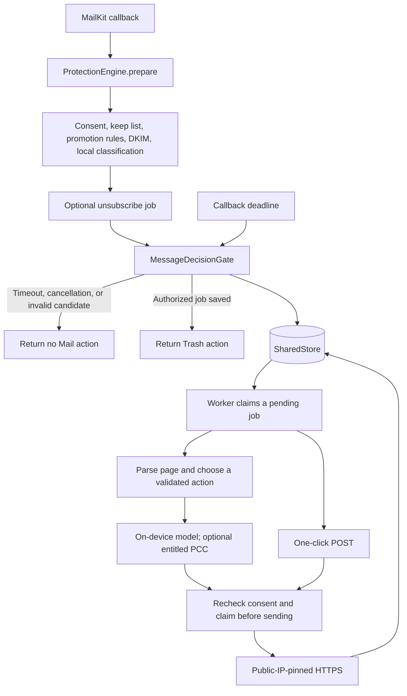

# Architecture

Transorma has two process entry points and one shared Swift module. The SwiftUI app owns user settings and resumable background work. The MailKit extension translates incoming-message callbacks into core decisions. `TransormaCore` implements the workflow without depending on SwiftUI or MailKit.

There is no application backend to build or deploy. `xcode-build-server` is a local development adapter that gives SourceKit-LSP the compiler settings from Xcode; it is not shipped with the app.

## Boundaries and directory structure

```text
App/
  TransormaApp.swift          Entry point and application lifetime
  AppModel.swift             Observable state and user actions
  LoginItem.swift            One-time login default and macOS registration state
  Views/                    Settings, Activity, and menu commands
  Resources/                Icon Composer artwork, assets, manifest, entitlements
TransormaMailExtension/
  MailExtension.swift       MailKit entry point
  MessageActionHandler.swift
  Resources/                Extension metadata, manifest, entitlements
Sources/
  TransormaCore/
    Mail/                   Message bytes, MIME, DKIM
    Protection/             Settings, policy, assessment, decision commitment
    Unsubscribe/            Jobs, HTML actions, worker
    Infrastructure/         Shared storage, HTTPS, DNS, Apple Intelligence
    MailError.swift
  CMailSystem/              System-library bridge
  TransormaDiagnostics/     Explicit live smoke checks
Tests/
  TransormaCoreTests/        Also run independently with SwiftPM
    Support/                Signed fixtures and controlled dependencies
  AppModelTests/            Persistence, recovery, lifecycle
  AppUITests/               User-visible behavior in the actual app
Config/                     Shared, Development, Debug, Release settings
```

Folders within `TransormaCore` organize responsibilities; they are not separate modules or layers requiring wrapper types. The app, extension, and diagnostics all link the same local package. Xcode owns native packaging and the app-hosted tests. Its synchronized source folders track files created in either editor. `Transorma.xcodeproj` holds the native targets and shared scheme; all product bundle identifiers remain stable.

Files are split at meaningful responsibilities: a message parser, a signature verifier, a store, a worker, and named screens. Closely coupled helpers such as HTTP framing stay with their implementation. A smaller file count would hide those responsibilities; adding a module or protocol for each file would add unnecessary coordination.

## Incoming message and unsubscribe flow



`ProtectionEngine.prepare` returns a candidate without enqueuing or unsubscribing. Its DNS and model reads can suspend. Separating assessment from commitment lets the Mail callback deadline revoke the right to act when those reads take too long.

Opening Mail can deliver a burst of messages that arrived while it was closed. These use the ordinary download callback; there is no inbox cursor, mailbox scan, or unread-message filter. The engine permits two active assessments and waits FIFO for up to 32 more, with at most 8 MB of queued message data and 2 MB per message. Waiting uses the same 20-second deadline as the Mail decision. Cancellation or expiry releases a waiting caller even if an active model request has not returned. Overflow and expired decisions preserve mail; MailKit does not offer a later replay API.

`MessageDecisionGate` serializes timeout and commitment with a lock. Only the winning caller can resolve the callback. It rechecks cancellation and the deadline before saving a candidate; the store checks current consent during that transaction. A successful save precedes Trash. A timed-out assessment cannot later enqueue work, and a storage failure preserves the message. The callback runs outside the lock so it can safely reenter. Local disk I/O during commitment can still delay delivery; installed extension timing needs platform validation.

The app and extension can both drain the queue. A worker drains ready jobs until idle, including jobs arriving during a pass; retry dates still apply. The app uses single-job passes to refresh progress between requests, without sleeping between ready jobs. Claiming a job marks it as processing in shared storage. Before a request is written, the worker verifies cancellation, that the same attempt still owns a live claim, and that current settings permit it. The real transport repeats this authorization after DNS and TLS setup, immediately before writing request bytes. Completion also compares attempts, preventing a stale worker from completing a newer retry. Requests already transmitted cannot be recalled by changing a setting.

## State and concurrency

`SharedStore` is the persisted source of truth. It uses a bounded versioned JSON document, an interprocess file lock, and atomic replacement. The app and Mail extension are separate processes: a Swift actor alone cannot coordinate their writes. Settings mutations, cancellation of pending jobs, queue insertion, and claims happen inside store transactions. UI changes mutate only their intended fields, preventing a stale snapshot from overwriting another process's changes.

The refactor preserves the existing App Group identifier, state version, Codable field names, job kinds/status values, and duplicate fingerprints. Moving files does not reset user settings or pending jobs.

The worker and assessment engine are actors. The UI model uses `@MainActor` and Observation's `@Observable`; views read it through SwiftUI's environment. The application delegate owns that model and starts its processing task in `applicationDidFinishLaunching`, independently of window presentation. It cancels the task and removes workspace observers on termination. Closing a window does not own or cancel processing.

The single window has Settings and Activity sections. Settings contains protection, Mail setup, intelligence, and login options. The app scene owns the selected section and shares its binding with the window, status menu, and standard menu commands. Open Transorma restores the current section; Settings selects Settings and opens the same window. The status menu contains only Open Transorma, Settings…, and Quit; protection and progress stay in the window.

There are currently no keep-list controls or per-sender actions in Activity. The core still honors previously saved sender exclusions for compatibility; removing their controls does not rewrite stored preferences. Activity cancellation, undo, and resubscription are not implemented.

The app signals catch-up when Mail launches or becomes active, when the Mac wakes, and after settings changes. An `AsyncStream` coalesces signals to one buffered event, including events arriving during a drain. A cancellable 15-second poll discovers extension writes and due retries while also refreshing progress. These events only resume our saved queue; they do not launch Mail, fetch messages, or invoke MailKit themselves. The displayed remaining count refers to pending/processing unsubscribe requests, not an estimate of how many messages Mail has yet to download. Store snapshots also refresh when the app becomes active.

Production and preview composition are explicit `AppModel.live()` and `.preview()` factories. Development builds always use disposable storage with no worker; the extension also disables processing in that configuration. Preview state is injected into the actual views, and native UI tests exercise the actual application. A separate preview executable is unnecessary.

`LoginItem` owns the app-only ServiceManagement boundary. The regular app applies its default registration once after shared storage is available; Development and previews omit this service. A private UserDefaults marker records the initial attempt, while macOS remains the source of truth for enabled/approval state. A later opt-out is never automatically reversed. Tests inject a fake service and isolated preferences, without changing the machine's login items.

## External services and model authority

Protocols exist for real external boundaries: DNS lookup, HTTP transport, and intelligence. Tests can suspend these operations and supply exact results without a mailbox, live network, or model. The store is concrete because tests can exercise its actual locking and persistence using temporary directories. There is no dependency-injection container, generic repository layer, or screen framework.

The on-device and optional PCC implementations share a narrow intelligence interface. A model classifies or selects an ID from actions already parsed and validated by code. It cannot invent a URL, HTTP method, or body. URL policy, signature coverage, consent, and request authorization remain deterministic. PCC requires a live authorization callback that rechecks current consent and the worker's claim immediately before cloud inference, including after a suspended local inference. Callers without that callback use only the on-device model. Both displayed page text and action labels pass through prompt redaction; redaction does not guarantee removal of every kind of personal information.

The native HTTPS implementation exists to connect to the validated public IP while verifying TLS against the original hostname. Its framing, limits, and redirect handling are part of the security boundary, with dedicated tests. Replacing it with a more general client requires preserving these guarantees, not merely matching method names. See [release preparation](RELEASE.md) for the remaining protocol and platform review.

## Build and editor ownership

Xcode configuration files own platform, language, warning, optimization, and signing policy. The shared scheme chooses Development for Run/Test and Release for Archive. SwiftPM owns the shared core, system bridge, diagnostics, and independent core tests.

The Makefile exposes native `xcodebuild`, `swift test`, and `swift-format` commands. VS Code tasks call those same Make targets. Two scripts remain because environment discovery and replaying Xcode compiler logs are more involved than a command alias. Neither duplicates target definitions or generates the Xcode project. The editor database is disposable and rebuilt after builds.

`swift-format` supplies format-on-save and strict style checks. Swift 6 checking and compiler warnings catch language/API problems; behavioral tests cover workflow boundaries. These do not require SwiftLint, Fastlane, or a project generator. See the [development guide](DEVELOPMENT.md) for commands and troubleshooting.

## References and future changes

Apple documents [local Swift packages within Xcode projects](https://developer.apple.com/documentation/xcode/organizing-your-code-with-local-packages). This supports sharing the core while leaving application packaging in Xcode.

[NetNewsWire](https://github.com/Ranchero-Software/NetNewsWire) combines native app/extension code, local modules, tests, scripts, and xcconfigs. [Userscripts](https://github.com/quoid/userscripts) is a published Safari extension project with Xcode, VS Code, and script tooling. These are useful structural examples rather than MailKit templates. Our choice is to adopt clear host/shared-code boundaries and native build ownership while keeping this smaller project's module and dependency count low.

Extract another package only when there is a concrete consumer or isolation requirement. Introduce a database when measured state size or query needs outgrow the bounded queue. Add build automation when there is a real distribution workflow to automate. A PCC-only execution restriction, if required by the approved entitlement, should be expressed in worker eligibility and composition rather than spread through views.
