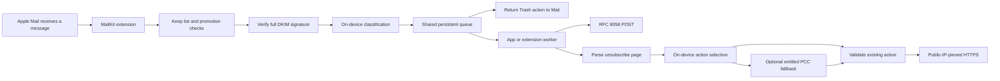

# Transorma

Automatic unsubscribe and marketing cleanup for Apple Mail on macOS 27.

Enable protection once. When Apple Mail receives a supported marketing message, Transorma queues an unsubscribe request and asks Mail to move the message to Trash. A companion app shows activity, manages senders to keep, and resumes queued work. There are no per-message approval dialogs.

This is a working implementation under development, **not a release-certified product**. Signed Mail integration, broad classification evaluation, and App Store validation remain necessary. See [release preparation](docs/RELEASE.md).

## What is implemented

- A MailKit message action extension using public APIs, App Sandbox, and a shared App Group.
- Conservative English-language promotion detection with transactional and personal-mail exclusions, followed by an on-device Apple Intelligence check when available.
- DKIM verification using CryptoKit/Security and system DNS. RSA-SHA256 and Ed25519-SHA256, simple/relaxed canonicalization, complete-body verification, signed classification and unsubscribe headers, exact From-domain alignment, duplicate-header rejection, and published RFC interoperability tests.
- RFC 8058 HTTPS POST with the exact one-click body, no cookies or credentials, and no redirects.
- An Apple Intelligence fallback for a signed email's explicit unsubscribe link, including bounded same-host navigation and simple HTML confirmation forms. Models select from a generated enum of validated action IDs; they cannot construct requests.
- macOS 27 `PrivateCloudComputeLanguageModel` with moderate reasoning, conditional on both user opt-in and the real signing entitlement. On-device inference runs first. PCC is disabled in the default build.
- Bounded persistent queue, cross-process exclusive claims, backoff on explicit temporary server errors, token deletion after completion, duplicate-request fingerprints, interrupted-request accounting, and seven-day expiry.
- Native setup, keep list, activity, login launch, pause, and in-app privacy information.

## Requirements and setup

1. Install [Xcode 27 RC or newer](https://developer.apple.com/download/applications/) and select it in Xcode → Settings → Locations → Command Line Tools. macOS 27's Foundation Models SDK is part of Xcode; no Python package, model download script, or third-party cloud service is needed.
2. Open `transorma.xcodeproj` and choose the shared **Transorma** scheme.
3. For a signed installation, select your developer team for both targets. Register `group.me.tylercross.transorma` for the app and extension, or replace that identifier consistently in both entitlements and `SharedStore.groupIdentifier`. Provisioned App Groups require appropriate developer-account access.
4. Build and run. In Mail → Settings → Extensions, enable Transorma and grant access to message contents. Then enable **Protect my inbox** in Transorma.
5. Keep Mail running for incoming-message processing. Keep Transorma running, optionally at login, to resume unsubscribe work after the extension exits.

The system's one-time extension activation and the app's one-time authorization are required setup. They are not repeated per email. Enabling protection authorizes automatic unsubscribe website requests and Trash actions. Recover messages in Mail's Trash; resubscription must happen on the sender's website.

### Toolchain found during development

On September 13, 2026 this Mac had macOS 27.0 RC (`26A428`), Swift 6.4, and the macOS 27 SDK in Command Line Tools, alongside **Xcode 26.6**. The core can build and test using those command-line tools. Xcode 26.6 cannot package the macOS 27 SDK (`SDK lookup failed for canonical name: macosx27.0`). A complete archive needs Xcode 27. Apple's RC download redirected to a developer sign-in page, so the IDE upgrade could not be installed automatically. The `fm` CLI is present but its machine-wide license has not been accepted; the app uses the Swift framework and does not depend on `fm`.

## Verification

```sh
# No real mail, external HTTP requests, or model calls:
zsh scripts/test-core.sh

# Current SDK + Xcode, including the app and embedded extension:
zsh scripts/verify.sh

# Read-only live probes. Uses example.com and a public DNS TXT record:
swift run transorma-diagnostics --network

# Synthetic examples sent only to the on-device model:
swift run transorma-diagnostics --intelligence

# Render a native preview with temporary settings and no unsubscribe worker:
zsh scripts/preview.sh
```

The normal tests inject DNS, HTTP responses, and intelligence choices. Real cryptographic fixtures cover tampering and signed-header handling. A separate diagnostics executable exercises actual DNS/TLS, three classification examples, and one page-action selection without reading a mailbox or sending unsubscribe requests. These synthetic checks are a smoke test, not evidence of production classification accuracy.

## Architecture



`Sources/TransormaCore` contains the policy, byte-preserving parser, verifier, transport, state, and workers. `mailextension` is the MailKit adapter. `transorma` contains the SwiftUI app. `Tests/TransormaCoreTests` runs independently of signing and Mail. There are no remote package dependencies. The local C module exposes Apple's system libxml2 and resolver; its compiler flag supplies the SDK's libxml2 include directory.

## Current coverage boundaries

- Processes new messages supplied by MailKit. It cannot enumerate an existing inbox, run while Mail is closed, or promise continuous extension lifetime. Workers resume on later Mail activity or while the companion app is open. A queued unsubscribe may complete after Trash is requested.
- Keeps ambiguous, encrypted, malformed, oversized, unsigned, unsupported-signature, or nonmatching messages. Two distinct promotion signals plus an unsubscribe destination are required; a list header alone does not prove marketing. This intentionally leaves many newsletters untouched.
- The fallback handles UTF-8 HTML, explicit links, same-host redirects, and POST forms made of hidden fields plus one explicit unsubscribe button. Login, CAPTCHA, JavaScript, cookies, cross-host navigation, arbitrary preference controls, and `mailto:` unsubscribe are not automated. Plain-text-only links without a List-Unsubscribe header are not yet extracted.
- DKIM validates the signing domain and covered message bytes; it does not establish that the sender is honest. This verifier applies a stricter subset of DKIM than a general mail server, so some valid mail is preserved. DNS has the security properties of the user's configured resolver.
- Inference errors keep a message or stop page processing. An accepted one-click response or a site's success text is recorded accurately; neither proves that future mail will stop. No automatic replay follows a transport interruption with an unknown outcome.
- Protection is off by default. No real mailbox was modified during development.

## Apple Intelligence and distribution

Apple's [macOS 27 APIs](https://developer.apple.com/documentation/foundationmodels/adding-server-side-intelligence-with-private-cloud-compute) expose Private Cloud Compute to eligible apps. [PCC access](https://developer.apple.com/private-cloud-compute) requires Small Business Program membership, fewer than two million first-time downloads, and an approved managed entitlement. Neither a macOS upgrade nor `fm` license acceptance grants an app that entitlement.

The default app and extension deliberately do not claim the PCC entitlement. After approval, enable it only in the target that will make PCC requests and verify the signed binary and provisioning profile. Do not set the entitlement just to suppress a runtime error. See [release preparation](docs/RELEASE.md) for exact validation and remaining work.

Relevant specifications: [MailKit message actions](https://developer.apple.com/documentation/mailkit/memessageactionhandler), [RFC 8058](https://www.rfc-editor.org/rfc/rfc8058), [RFC 6376](https://www.rfc-editor.org/rfc/rfc6376), [RFC 8463](https://www.rfc-editor.org/rfc/rfc8463), [App Review Guidelines](https://developer.apple.com/app-store/review/guidelines/).
